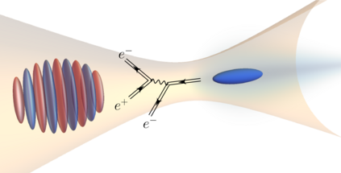

# Ptarmigan

   

Simulate the interaction between a high-energy particle beam and an intense laser pulse, including the classical dynamics and strong-field QED processes.

  

## Documentation

Information about the physics processes included in Ptarmigan, as well as how to build and run the code, can be found in the online documentation: https://tgblackburn.github.io/ptarmigan/.

## Contribute

Pull requests, bug fixes and new features, are welcome!

Contributors:

* Tom Blackburn
* Kyle Fleck

## Reference

The main reference for Ptarmigan is

> T. G. Blackburn, B. King and S. Tang,
"Simulations of laser-driven strong-field QED with Ptarmigan: Resolving wavelength-scale interference and ɣ-ray polarization,"
[Physics of Plasmas 30, 093903 (2023)](https://doi.org/10.1063/5.0159963),
[arXiv:2305.13061 \[hep-ph\]](https://arxiv.org/abs/2305.13061)

and individual releases are archived on [Zenodo](https://doi.org/10.5281/zenodo.7956999).