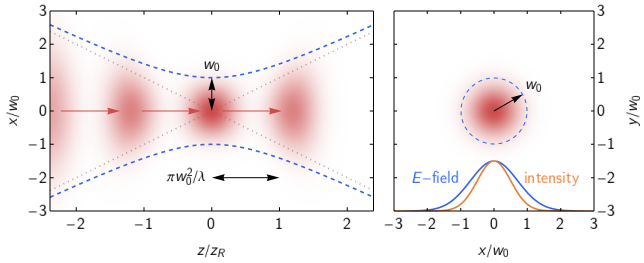
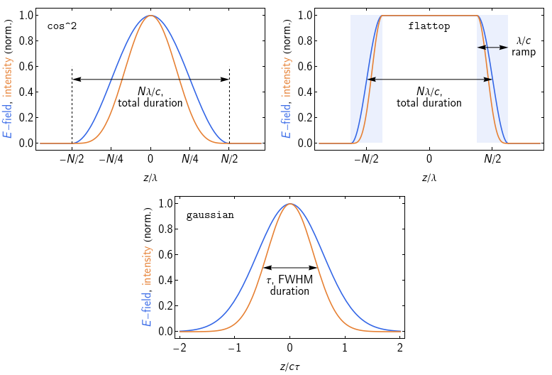

# Specifying a laser pulse

### Basic information

* `a0`: the laser strength parameter, normalized amplitude, etc.
Defined by the peak electric field, so a0 is sqrt(2) larger for LP than for CP at fixed intensity.
Alternatively, specifying `a0:start`, `a0:step` and `a0:stop` will run a single simulation for all a0 values in the given range.
* `wavelength`: of the carrier wave, in metres, or
* `omega`: the equivalent photon energy, in joules. The conversion constants `eV` etc are provided for convenience.
* `polarization`: the polarization of the carrier wave, either `linear` or `circular`.
In LP, the default is that the electric field is parallel to the `x` axis.
Change this by specifying `linear || x`, `linear || y` or `linear @ angle`, where the `angle` is defined with respect to the `x` axis.

### Transverse profile

* `waist` (optional): if specified, the laser pulse will be focused to a spot size of `waist`, which defines the radius
at which the intensity falls to $1/e^2$ of its maximum value. Otherwise the laser is modelled as a plane wave.
    

    
    

    The transverse size of the focusing pulse is controlled by the waist $w_0$ and Rayleigh range $z_R = \pi w_0^2 / \lambda$:
    the intensity distribution (left) as the pulse passes through focus and (right) in the focal plane.
    The waist is related to the $f$-number by $w_0 = 2 f \lambda / \pi$.

### Temporal envelope

* `envelope` (optional, default is `cos^2` in 1D and `gaussian` in 3D): the temporal envelope of the laser pulse. Select one of:
    * `cos^2`
    * `flattop` (constant intensity over the specified number of cycles, with a one-wavelength long, smooth ramp-up and ramp-down)
    * `gaussian`
    

    
    

* `fwhm_duration` (if `envelope: gaussian`): the full width at half max of the *intensity envelope*, in seconds.
* `n_cycles` (if `envelope: cos^2` or `flattop`): the total duration of the pulse, expressed in wavelengths. Usually (but not required to be) an integer.
* `chirp_coeff` (optional, ignored if `waist` is specified): specifies `b`, the chirp coefficient, which appears in the total phase `ϕ + b ϕ^2` of the laser carrier wave. A positive `b` leads to an instantaneous frequency that increases linearly from head to tail.
