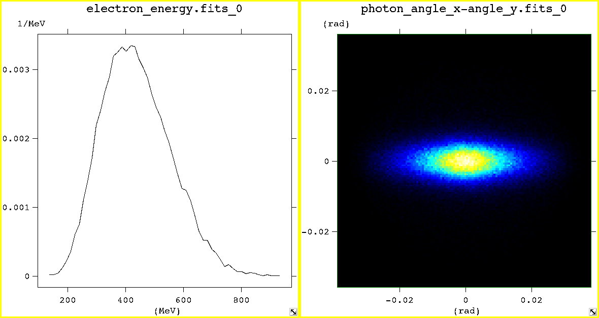
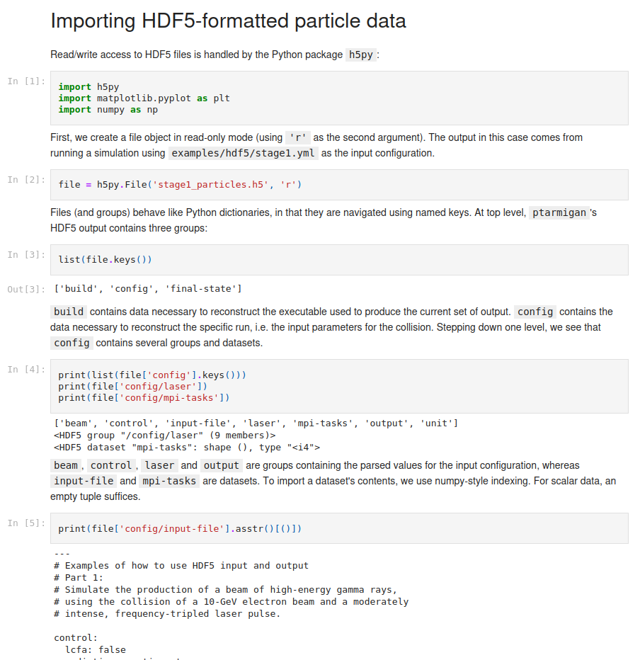

# Inspecting output

### FITS

FITS (Flexible Image Transport System) is a convenient format for 1D and 2D spectra, because it combines
a human-readable header for metadata and a binary-formatted data block.

The following keys will be available in the file header:

  * `NAXIS`: the number of dimensions, 1 or 2
  * `CNAMEn`: the name of variable associated with axis `n`
  * `CUNITn`: the unit associated with that variable
  * `NAXISn`: the number of data points along axis `n`
  * `CRPIXn`, `CRVALn`, `CDELTn`: the coordinate of data point `j` along axis `n` is `CRVALn + (j + CRPIXn) * CDELTn`, where `0 <= j < NAXISn`
  * `OBJECT`: the name of the spectrum
  * `BUNIT`: the unit associated with the spectrum
  * `TOTAL`: integrated value of the spectrum
  * `COMMENT`: Ptarmigan version (and its commit hash, if available) that generated this output

The data is stored in a binary blob of 64-bit floating-point numbers.
The ordering of the data points is defined by the header.
The index along axis `1` varies most rapidly, and the index along axis `2` varies least rapidly.

Fv is an easy-to-use graphical FITS file viewer, available from https://heasarc.gsfc.nasa.gov/ftools/fv/.

  
   <figcaption><em>Viewing FITS output with fv. Input file: examples/gamma_profile.yml.</em></figcaption>

### HDF5

HDF5 (Hierarchical Data Format) provides a structured, self-describing output format, suitable for large
arrays of numerical data.
Each file behaves like a filesystem in its own right, with "datasets" (files) organised into "groups" (folders).
The structure of the HDF5 file produced by Ptarmigan is as follows:

* `build`
  * `version`
  * `branch`
  * `commit-hash` (short SHA-1)
  * `features` (comma-separated list of the [optional features](build.md#optional-features) Ptarmigan was built with)

* `config`
  * `mpi-tasks`
  * `input-file`
  * `unit` (default units for the datasets in `final-state/.../`)
    * `position`
    * `momentum`
  * `control`
    * values for all input parameters described [here](input_guide/control.md)...
  * `laser`
    * values for all input parameters described [here](input_guide/laser.md)...
  * `beam`
    * `imported_from_file` (`true` if beam is loaded from an external file, `false` if generated by Ptarmigan)
    * values for all input parameters described [here](input_guide/beam_generation.md) or [here](input_guide/beam_loading.md), as appropriate...
  * `output`
    * values for all input parameters described [here](input_guide/output.md)...

* `final-state`
  * `photon`
    * `weight` (number of real particles each macroparticle represents)
    * `id` (unique ID of each particle)
    * `parent_id` (ID of the electron/positron that emitted each photon)
    * `position` ( `[ct, x, y, z]` )
    * `momentum` ( `[E/c, p_x, p_y, p_z]`)
    * `polarization` (Stokes parameters `[1, S_1, S_2, S_3]`, alias: `polarisation`)
    * `n_pos` (total probability of pair creation for each photon)
    * `a0_at_creation` (normalized amplitude, RMS under LMA, at point of emission, alias: `xi`)
    * `parent_chi` (quantum parameter, RMS under LMA, of parent at point of emission)
  * `electron`
    * `weight`
    * `id`
    * `parent_id`
    * `position`
    * `momentum`
    * `n_gamma` (total number of photons emitted by each electron)
    * `absorption` (energy absorbed from the laser by each electron)
  * `positron`
    * ... as for `electron`, but additionally:
    * `a0_at_creation`
    * `parent_chi`
  * `laser`
    * `energy` (in 3D) or `energy_flux` (1D)
    * `absorption` (total energy absorbed from the laser in the collision)

* `intermediate-state` (if `dump_decayed_photons: true`)
  * `photon`
    * same datasets as `final-state/photon`

Each dataset in `final-state/.../` has the following attributes:
  * `desc` (short description of the variable)
  * `unit` (the relevant unit)

Many different software tools exist to import data from HDF5 files.
An example of how to use h5py in a Jupyter notebook is provided in the `examples/hdf5` directory.

  
   <figcaption><em>Importing HDF5 data with Jupyter: see examples/hdf5/analysis.ipynb for more</em>.</figcaption>

