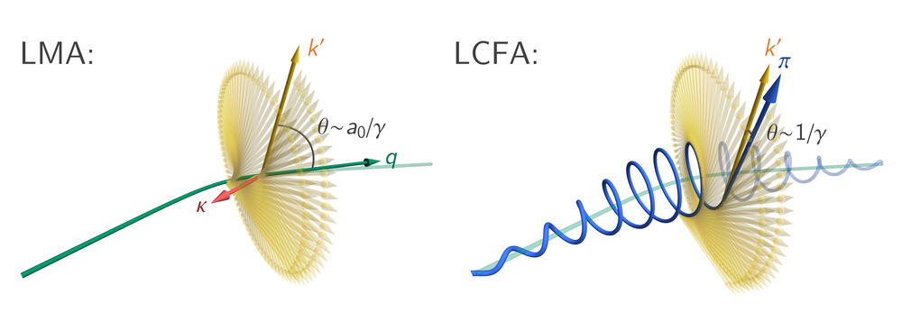

# Physics coverage

## Processes

The fundamental processes included in Ptarmigan are:

* photon emission (nonlinear Compton scattering)
* electron-positron pair creation (nonlinear Breit-Wheeler)

These provide the building blocks for higher order processes, like electromagnetic showers.

| <br>Process |<br>$e^\pm$ | polarization<br>$\gamma$ | <br>laser | <br>QED | Modes<br>classical | <br>mod. clas. |
| :-: | :-: | :-: | :-: | :-: | :-: | :-: |
| $e^\pm \to e^\pm \gamma$ | averaged (initial),<br>summed (final) | arbitrary | LP / CP | LMA / LCFA | LMA / LCFA | LCFA |
| $\gamma \to e^+ e^-$ | summed | arbitrary | LP / CP | LMA / LCFA | n/a* | n/a* |

LP = linear polarization, CP = circular polarization

*Pair creation has no classical equivalent.

## LMA or LCFA

Ptarmigan models particle dynamics and strong-field QED events using one of two approximations:

* the locally monochromatic approximation (LMA)
* the locally constant crossed field approximation (LCFA).

In the LMA, the laser pulse is treated as slices of monochromatic plane wave with defined amplitude and frequency.
Particle trajectories are only defined at the cycle-averaged level, using the quasimomentum $q^\mu$, and not at scales smaller than the laser wavelength.
The strong-field QED rates account for interference at this scale.

In the LCFA, the laser pulse is treated as slices of constant, crossed field.
Particle trajectories are defined at all timescales, using the kinetic momentum $\pi^\mu$.
Strong-field QED events are assumed to occur instantaneously, which is reasonable if the formation length is much smaller than the laser wavelength.

<p align="center">
  
  <figcaption align="left"><b>The electron trajectory and a photon emission event, as viewed in the LMA (left) and LCFA (right). Adapted from <a href="https://doi.org/10.1088/1367-2630/ac1bf6">this paper</a>.</b></figcaption>
</p>

The picture above shows the conceptual differences between the LMA and the LCFA for a photon emission event.
In the LCFA, the fast oscillation is resolved at the level of the classical trajectory.
This imprints itself on the angular structure of the radiation as the emitted photon is strongly beamed in the (instantaneous) forward direction.
An equivalent structure emerges in the LMA due to quasimomentum conservation, because the fast oscillation is folded into the QED rates.
However, if the photon formation length is comparable in size to the laser wavelength, this angular structure is modified by interference effects in a way that the LCFA cannot capture.

The LMA is default mode in Ptarmigan.
To select the LCFA instead, ensure that the `control` block contains:

```yaml
control:
    ... # other keys
    lcfa: true
```

If this key is absent (or `false`), the LMA is selected instead.

The LMA is available for $a_0 \leq 20$ and $\eta = \chi / a_0 \leq 2$.
The LCFA is available for arbitrary values of the same.

## QED or classical

In QED, photon emission (and pair creation) are stochastic events and occur randomly along the particle trajectory.
As an alternative, Ptarmigan can model laser-beam collisions using classical electrodynamics, which is deterministic.
The electron does not recoil at individual emission events.
Instead, energy loss is accounted for by a radiation reaction force, here in the Landau-Lifshitz prescription.

The choice of QED or classical is orthogonal to the choice of LMA or LCFA, i.e. interference effects in the classical domain can be accessed using:

```yaml
control:
    ... # other keys
    classical: true
    lcfa: false
```

If `classical` is absent (or set to `false`), Ptarmigan uses the full QED model.

### A quantum-corrected classical model

Classical electrodynamics overpredicts the amount of radiated energy, because the spectrum does not contain a cutoff at the electron energy, $\omega' < E / \hbar$.
Correcting the spectrum for this cutoff, and reducing the radiated power and radiation-reaction force accordingly, results in a "modified classical" model:

```yaml
control:
    ... # other keys
    classical: gaunt_factor_corrected
    lcfa: true
```

This model is only available under the LCFA.
As it uses a deterministic radiation-reaction force, it does not include stochastic effects.